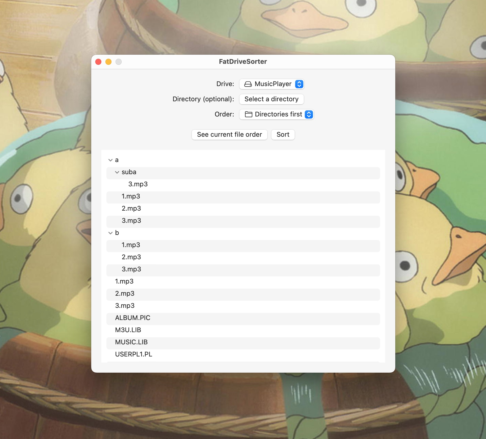

# Introduction

**FatDriveSorter** helps you *actually* sort files on your FAT drives

## Why does this exist?

FAT drives store files using a **raw** sort order. It's not alphabetical, most recent, etc. It's a purely technical sort order which the user can't enforce easily.

Some simple devices, such as MP3 players or hand-held consoles, display files without sorting. This leads to a surprising sort order for the user. FatDriveSorter uses technical tricks to enforce a better sort order.

## Features

* Enforce raw file order on your FAT drives (FAT12, FAT16, FAT32 and exFAT)
* See the current raw file order
* Customize the sort order
* Only sort a specific directory

## Installation

[**Download the latest release**]({{ site.github.latest_release.assets[0].browser_download_url }})

Alternatively, you can use [homebrew](https://brew.sh/):

| Homebrew 2.7 and above                 | Homebrew 2.5 and 2.6             | Homebrew 2.4 and below               |
|----------------------------------------|----------------------------------|--------------------------------------|
| `brew install --cask fat-drive-sorter` | `brew install fat-drive-sorter`  | `brew cask install fat-drive-sorter` |

## Compatibility

* __macOS version:__ from 10.12 to latest
* __Apple Silicon:__ yes, FatDriveSorter is [universal](https://developer.apple.com/documentation/apple-silicon/porting-your-macos-apps-to-apple-silicon)

## Localization

FatDriveSorter is available in: English

[Contribute your own language easily!](https://poeditor.com/join/project/TTqkcdPO9V)

## Privacy and respecting the user

* FatDriveSorter doesn’t send or receive any data without explicit user consent. It may ask the user to send a crash report after a crash for example, but it will never spy on the user.
* FatDriveSorter tries to use as few resources as it can: CPU, memory, disk, etc. All images are compressed, FatDriveSorter is optimized to be as light as possible on the user resources.

## Using the embedded fatsort CLI

FatDriveSorter includes a built of [fatsort](https://fatsort.sourceforge.io/). It is located in the .app bundle, at `FatDriveSorter.app/Contents/MacOS/fatsort`. It can be called from the Terminal to do advanced sorting. You can call `fatsort -h` for to see the options.

## License

FatDriveSorter is under the [GPL-3.0 license](https://github.com/lwouis/fat-drive-sorter/blob/master/LICENCE.md). 
